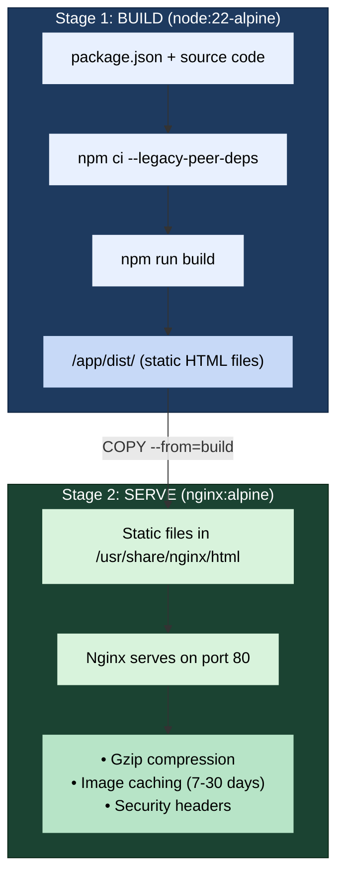

# Lyhor Portfolio

A minimal, clean graphic design portfolio for **Kimhornn Lyhor** — built with **Astro + Tailwind CSS**, packaged with **Docker** for easy deployment.

---

## 🚀 Quick Start (Local Development)

```bash
# 1. Install dependencies
npm install --legacy-peer-deps

# 2. Start dev server (hot reload)
npm run dev
```

Open **http://localhost:4321**

---

## 📁 Project Structure

```
├── public/
│   ├── favicon.svg
│   ├── icons/              ← Adobe tool logos
│   └── images/             ← Portfolio showcase images
├── src/
│   ├── components/
│   │   ├── Navbar.astro     ← Sticky nav with mobile menu
│   │   ├── Hero.astro       ← Name, title, CTA
│   │   ├── About.astro      ← Bio
│   │   ├── Skills.astro     ← Adobe Suite + soft skills
│   │   ├── Work.astro       ← Masonry gallery
│   │   ├── Experience.astro ← Work history + education
│   │   └── Contact.astro    ← Email, phone, location
│   ├── layouts/Layout.astro
│   ├── pages/index.astro    ← Main single page
│   └── styles/global.css    ← Tailwind + custom styles
├── Dockerfile               ← Multi-stage Docker build
├── docker-compose.yml       ← Single-command deployment
├── deploy.sh                ← Deploy script with IP/port info
├── nginx.conf               ← Production Nginx config
├── .gitignore
└── .dockerignore
```

---

## 🐳 Docker Deployment

### How It Works

The Docker setup uses a **multi-stage build** (two phases):



**Key points:**
- **Stage 1 (Build):** Node.js installs dependencies and builds the Astro site into static HTML files (`dist/`)
- **Stage 2 (Serve):** Takes only the built files + lightweight Nginx Alpine (~25MB final image)
- The result is a **tiny, production-ready Docker image** (~32MB) with zero runtime dependencies

### Build & Deploy (One Command)

```bash
# Build and start (builds image + runs container, shows IP and port)
./deploy.sh
```

Or using Docker Compose directly:

```bash
# Build and start
docker compose up -d

# View logs
docker compose logs -f

# Stop
docker compose down

# Rebuild after code changes
docker compose up -d --build
```

Your portfolio will be available at **http://localhost:629**

### Nginx Configuration

The custom `nginx.conf` handles:

| Feature | Setting | Benefit |
|---------|---------|---------|
| Gzip compression | On for text/CSS/JSON/SVG | Smaller downloads, faster page loads |
| Icon caching | 30 days (immutable) | Icons load instantly on repeat visits |
| Image caching | 7 days | Portfolio images cached for a week |
| Security headers | X-Frame-Options, X-Content-Type-Options | Prevents clickjacking, MIME sniffing |

---

## ☁️ Deploy to Ubuntu LXC Container

### Option A: Docker Compose (Recommended)

```bash
# 1. Install Docker + Compose plugin
sudo apt update
sudo apt install -y docker.io docker-compose-plugin
sudo systemctl enable --now docker

# 2. Clone the repo
git clone https://github.com/Crazzygem/lyhor-portfolio.git
cd lyhor-portfolio

# 3. Build & run (single command)
./deploy.sh

# 4. Verify
curl http://localhost:629
```

### Option B: Direct Nginx (No Docker)

```bash
# 1. Install Nginx + Node.js
sudo apt update
sudo apt install -y nginx nodejs npm

# 2. Clone and build
git clone https://github.com/YOUR_USER/lyhor-portfolio.git
cd lyhor-portfolio
npm install --legacy-peer-deps
npm run build

# 3. Copy built files to nginx
sudo cp -r dist/* /var/www/html/
sudo systemctl restart nginx
```

---

## ✏️ How to Update Content

### For your friend (developer):
1. Clone the repo: `git clone <url>`
2. Install: `npm install --legacy-peer-deps`
3. Edit components in `src/components/`
4. Preview: `npm run dev`
5. Build: `npm run build`
6. Re-deploy: `./deploy.sh`
 
### Adding new portfolio images:
1. Place images in `public/images/`
2. Edit `src/components/Work.astro` — add the filename to the `projects` array
3. Rebuild & redeploy: `./deploy.sh`

---

## 🛠 Commands

| Command | Action |
|---------|--------|
| `npm run dev` | Start dev server (localhost:4321) |
| `npm run build` | Build to `dist/` |
| `npm run preview` | Preview built site |
| `./deploy.sh` | Build + run + show IP and port |
| `docker compose up -d` | Build + run container on port 629 |
| `docker compose up -d --build` | Rebuild + restart after changes |
| `docker compose down` | Stop container |
| `docker compose logs -f` | Follow container logs |

---
